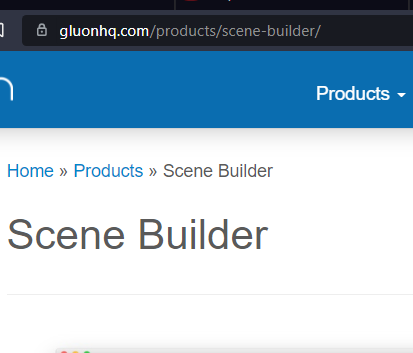
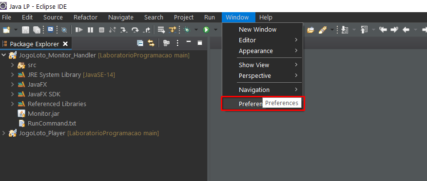
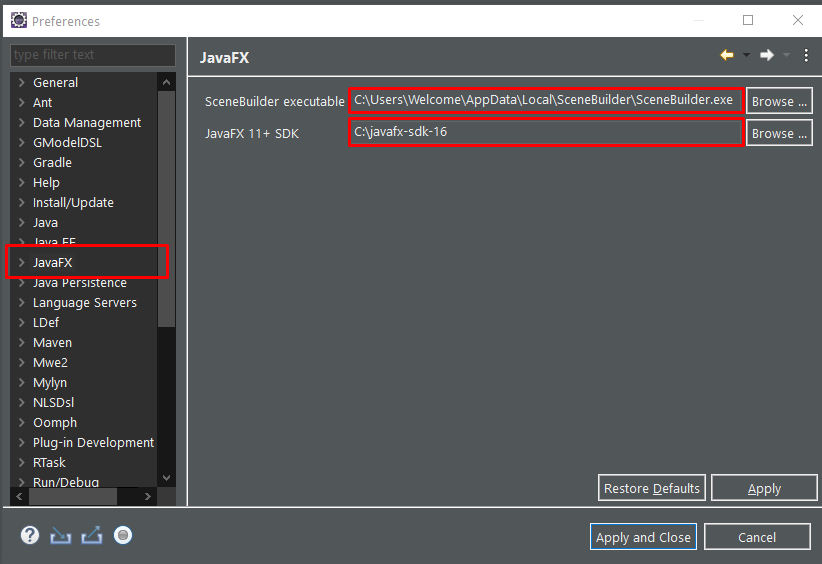
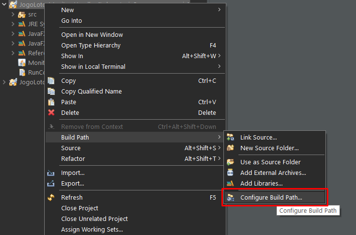
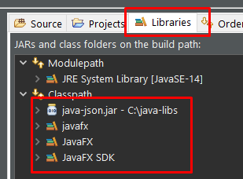
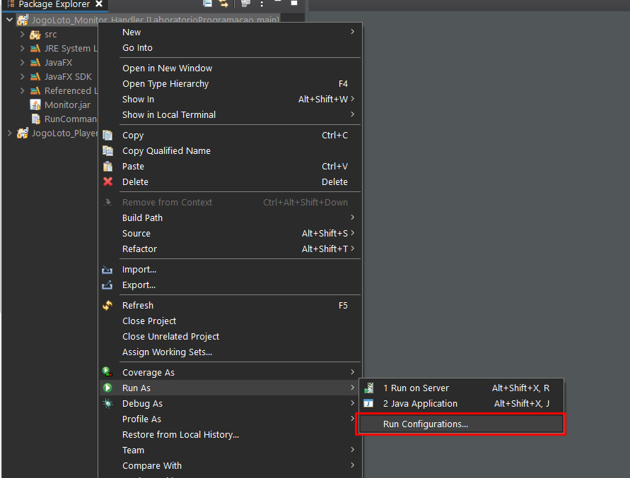
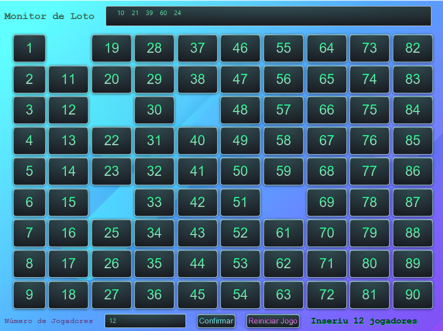

# Grupo
```
Ivan Xavier - 92441
```
# Fase 1 - Download



Pode usar as librarias do repositório ou descarregar novamente, precisa de instalar o SceneBuilder

SceneBuilder:
* https://gluonhq.com/products/scene-builder/

JavaFX SDK:
* https://gluonhq.com/products/javafx/

JSON JAR:
* https://jar-download.com/artifacts/org.json

# Fase 2 - Preferências

* Localize o executável do SceneBuilder instalado na sua máquina
* Localize o javaFX SDK descarregado
* Introduza a localização de ambos nas preferências



# Fase 3 - Librarias

* No Build Path adicione as librarias do JavaFX e do JSON



# Fase 4 - Virtualização

* Adicione os argumentos de virtualização


```
--module-path "C:\LOCALIZAÇÂO\DO\JAVAFX\SDK" --add-modules javafx.controls,javafx.fxml
```
* Exemplo:
```
--module-path "C:\javafx-sdk-16\lib" --add-modules javafx.controls,javafx.fxml
```

# Monitor


# Encoding
```
javac -encoding UTF8 src/*
```
# Correr o código
```
java -cp . App
```

# LaboratorioProgramacao
Exercícios e trabalhos realizados no âmbito da unidade curricular "Laboratório de Programação"

# Jogo do Loto

### Cartão
* Composto por uma matriz 3x9 (3D)
* Cada linha tem sempre 5 números
* Cada coluna tem entre 0 e 3 números
* 1ª coluna de 1 a 9
* 2ª até á 8ª coluna em intervalos de x0 a x9
* 8ª coluna de 80 a 90

### Jogo
* Apenas um cartão
* Representação na consola
* Sorteio independente do jogo
* Assinalar o cartão com o número obtido
* Avisar sempre que a linha fica completa
* No final apresentar mensagem de conclusão
* Após a conclusão pode reiniciar ou continuar com o mesmo cartão

### Documentação
* Documentação JavaDoc do programa
* Indicar como executar a aplicação sem recurso ao IDE

## Implementação

### Jogo

Variáveis

    Array 2D
    ArrayCópia 2D
    Número escolhido

Métodos

    Gerar o cartão
    Trocar Repetidos
    Colocar Espaços em Branco
    Pedir Cartão
    Pedir Menu
    Atribuir número escolhido
    Copiar o cartão original
    Verificar conclusão do cartão
    Reiniciar o Jogo
    
Validação simples e de exceções

Percorrer listas bidimensionais 

```java
    public void getClone(int[][] cartaoCopia, int[][] cartao) {
        for (int lin = 0; lin<3; lin++) {
            for (int col = 0; col < 9; col++) {
                cartaoCopia[lin][col] = cartao[lin][col];
            }
        }
    }
```

### Jogador
* Menu
* Implementa objeto do jogo
* Recebe cartão
* Introduz números
* Reinicia ou Saí


